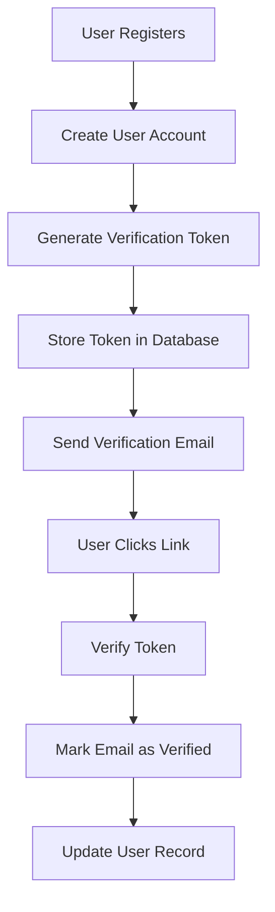

# Email Verification Schema Guide

This guide covers the email verification schema (`src/db/email-verification.schema.ts`), which handles email verification tokens for user account confirmation.

## Overview

The email verification schema provides a secure system for verifying user email addresses during registration. It stores verification tokens that are sent to users' email addresses and tracks when verification occurs.

## Table Structure

### `emailVerificationTable`

Stores email verification tokens and tracks verification status.

```typescript
export const emailVerificationTable = pgTable("email_verification", {
    id: integer("id").primaryKey().generatedAlwaysAsIdentity(),
    userId: integer("user_id")
        .notNull()
        .references(() => usersTable.id),
    token: varchar("token", { length: 255 }).notNull().unique(),
    createdAt: timestamp("created_at").notNull().defaultNow(),
    verifiedAt: timestamp("verified_at"),
});
```

| Column       | Type           | Constraints                 | Description                               |
| ------------ | -------------- | --------------------------- | ----------------------------------------- |
| `id`         | `integer`      | Primary Key, Auto-increment | Unique verification record identifier     |
| `userId`     | `integer`      | Not Null, Foreign Key       | References `usersTable.id`                |
| `token`      | `varchar(255)` | Not Null, Unique            | Verification token (JWT or random string) |
| `createdAt`  | `timestamp`    | Not Null, Default: now()    | Token creation timestamp                  |
| `verifiedAt` | `timestamp`    | Nullable                    | Verification completion timestamp         |

### Indexes and Constraints

- **Primary Key**: `id`
- **Unique Constraint**: `token` (ensures each token is unique)
- **Foreign Key**: `userId` references `usersTable.id`

## Token Generation and Verification Flow

### 1. Registration Flow



### 2. Token Lifecycle

1. **Token Creation**: Generate secure token during user registration
2. **Email Sending**: Send verification link with token to user's email
3. **Token Validation**: Verify token when user clicks email link
4. **Account Activation**: Mark user's email as verified
5. **Token Cleanup**: Remove or mark token as used

## Usage Examples

### 1. Repository Layer

```typescript
import { emailVerificationTable } from "@/db/email-verification.schema";
import { usersTable } from "@/db/users.schema";
import { eq, and, isNull } from "drizzle-orm";

@injectable()
export class EmailVerificationRepository {
    async createVerificationToken(userId: number, token: string): Promise<void> {
        await this.db.insert(emailVerificationTable).values({
            userId,
            token,
        });
    }

    async findValidToken(token: string): Promise<EmailVerification | null> {
        const [verification] = await this.db
            .select()
            .from(emailVerificationTable)
            .where(and(eq(emailVerificationTable.token, token), isNull(emailVerificationTable.verifiedAt)));

        return verification || null;
    }

    async markTokenAsVerified(id: number): Promise<void> {
        await this.db
            .update(emailVerificationTable)
            .set({ verifiedAt: new Date() })
            .where(eq(emailVerificationTable.id, id));
    }

    async findTokenByUserId(userId: number): Promise<EmailVerification | null> {
        const [verification] = await this.db
            .select()
            .from(emailVerificationTable)
            .where(and(eq(emailVerificationTable.userId, userId), isNull(emailVerificationTable.verifiedAt)))
            .orderBy(desc(emailVerificationTable.createdAt))
            .limit(1);

        return verification || null;
    }

    async deleteExpiredTokens(expirationHours = 24): Promise<void> {
        const expirationDate = new Date(Date.now() - expirationHours * 60 * 60 * 1000);

        await this.db
            .delete(emailVerificationTable)
            .where(
                and(
                    sql`${emailVerificationTable.createdAt} < ${expirationDate}`,
                    isNull(emailVerificationTable.verifiedAt),
                ),
            );
    }

    async getUserVerificationStatus(userId: number): Promise<{
        hasVerified: boolean;
        pendingVerification: boolean;
        lastVerificationAt?: Date;
    }> {
        const verifications = await this.db
            .select()
            .from(emailVerificationTable)
            .where(eq(emailVerificationTable.userId, userId))
            .orderBy(desc(emailVerificationTable.createdAt));

        const hasVerified = verifications.some((v) => v.verifiedAt !== null);
        const pendingVerification = verifications.some((v) => v.verifiedAt === null);
        const lastVerificationAt = verifications
            .filter((v) => v.verifiedAt !== null)
            .sort((a, b) => (b.verifiedAt?.getTime() || 0) - (a.verifiedAt?.getTime() || 0))[0]?.verifiedAt;

        return {
            hasVerified,
            pendingVerification,
            lastVerificationAt,
        };
    }
}
```

### 2. Authentication Service Integration

```typescript
import { EmailVerificationRepository } from "@/repositories/email-verification.repository";
import { UserRepository } from "@/repositories/user.repository";
import { JWT_RESET_SECRET, FRONTEND_URL } from "@/config/env";

@injectable()
export class AuthenticationService {
    constructor(
        @inject(TYPES.EmailVerificationRepository)
        private emailVerificationRepository: EmailVerificationRepository,
        @inject(TYPES.UserRepository)
        private userRepository: UserRepository,
        @inject(TYPES.MailerService)
        private mailerService: IMailerService,
    ) {}

    async sendVerificationEmail(userId: number, email: string): Promise<void> {
        // Generate verification token (JWT with expiration)
        const verificationToken = jwt.sign({ userId, type: "email_verification" }, JWT_RESET_SECRET, {
            expiresIn: "24h",
        });

        // Store token in database
        await this.emailVerificationRepository.createVerificationToken(userId, verificationToken);

        // Create verification link
        const verificationLink = `${FRONTEND_URL}/verify-email?token=${verificationToken}`;

        // Send email
        await this.mailerService.sendVerificationEmail(email, verificationLink);
    }

    async verifyEmail(token: string): Promise<{ success: boolean; message: string }> {
        try {
            // Verify JWT token
            const payload = jwt.verify(token, JWT_RESET_SECRET) as any;

            if (payload.type !== "email_verification") {
                return { success: false, message: "Invalid token type" };
            }

            // Find token in database
            const verification = await this.emailVerificationRepository.findValidToken(token);

            if (!verification) {
                return { success: false, message: "Token not found or already used" };
            }

            // Mark token as verified
            await this.emailVerificationRepository.markTokenAsVerified(verification.id);

            // Update user's email verification status
            await this.userRepository.updateEmailVerification(verification.userId);

            return { success: true, message: "Email verified successfully" };
        } catch (error) {
            if (error instanceof jwt.TokenExpiredError) {
                return { success: false, message: "Verification token has expired" };
            }

            return { success: false, message: "Invalid verification token" };
        }
    }

    async resendVerificationEmail(email: string): Promise<{ success: boolean; message: string }> {
        // Find user by email
        const user = await this.userRepository.findByEmail(email);

        if (!user) {
            return { success: false, message: "User not found" };
        }

        if (user.emailVerified) {
            return { success: false, message: "Email already verified" };
        }

        // Check if there's a recent verification token
        const existingVerification = await this.emailVerificationRepository.findTokenByUserId(user.id);

        if (existingVerification) {
            const timeSinceCreation = Date.now() - existingVerification.createdAt.getTime();
            const fiveMinutes = 5 * 60 * 1000;

            if (timeSinceCreation < fiveMinutes) {
                return {
                    success: false,
                    message: "Please wait 5 minutes before requesting another verification email",
                };
            }
        }

        // Send new verification email
        await this.sendVerificationEmail(user.id, user.email);

        return { success: true, message: "Verification email sent" };
    }
}
```

### 3. Route Implementation

```typescript
import { emailVerificationSchema } from "@/db/users.schema";
import { validation } from "@/middlewares/validation.middleware";

// Verify email endpoint
router.post(
    "/verify-email",
    validation(z.object({ body: emailVerificationSchema })),
    async (req: Request, res: Response) => {
        const { token } = req.body;

        const result = await authService.verifyEmail(token);

        if (result.success) {
            res.status(200).json({
                success: true,
                message: result.message,
            });
        } else {
            res.status(400).json({
                success: false,
                message: result.message,
            });
        }
    },
);

// Resend verification email endpoint
router.post(
    "/resend-verification",
    validation(
        z.object({
            body: z.object({
                email: z.string().email(),
            }),
        }),
    ),
    async (req: Request, res: Response) => {
        const { email } = req.body;

        const result = await authService.resendVerificationEmail(email);

        const statusCode = result.success ? 200 : 400;
        res.status(statusCode).json(result);
    },
);
```

## Security Considerations

### 1. Token Security

- **Use JWT tokens** with expiration for verification
- **Include token type** in JWT payload for validation
- **Generate cryptographically secure** random tokens
- **Set reasonable expiration times** (24 hours recommended)

### 2. Rate Limiting

- **Limit verification email requests** per user/IP
- **Implement cooldown periods** between requests
- **Track failed verification attempts**

### 3. Token Validation

- **Always verify token signature** and expiration
- **Check token exists in database** before processing
- **Prevent token reuse** by marking as verified
- **Clean up expired tokens** regularly

### 4. Email Sending

- **Use secure email providers** (SendGrid, AWS SES)
- **Implement email sending retries** with exponential backoff
- **Log email sending attempts** for debugging
- **Handle email delivery failures** gracefully

## Common Queries

### Find Pending Verifications

```typescript
const pendingVerifications = await db
    .select({
        verification: emailVerificationTable,
        user: usersTable,
    })
    .from(emailVerificationTable)
    .innerJoin(usersTable, eq(emailVerificationTable.userId, usersTable.id))
    .where(isNull(emailVerificationTable.verifiedAt));
```

### Get Verification Statistics

```typescript
const stats = await db
    .select({
        totalTokens: sql<number>`COUNT(*)`,
        verifiedTokens: sql<number>`COUNT(${emailVerificationTable.verifiedAt})`,
        pendingTokens: sql<number>`COUNT(*) - COUNT(${emailVerificationTable.verifiedAt})`,
    })
    .from(emailVerificationTable);
```

### Find Expired Tokens

```typescript
const expiredTokens = await db
    .select()
    .from(emailVerificationTable)
    .where(
        and(
            sql`${emailVerificationTable.createdAt} < NOW() - INTERVAL '24 hours'`,
            isNull(emailVerificationTable.verifiedAt),
        ),
    );
```

### Get User Verification History

```typescript
const verificationHistory = await db
    .select()
    .from(emailVerificationTable)
    .where(eq(emailVerificationTable.userId, userId))
    .orderBy(desc(emailVerificationTable.createdAt));
```

## Type Definitions

### Inferred Types

```typescript
// Table types
type EmailVerification = typeof emailVerificationTable.$inferSelect;
type NewEmailVerification = typeof emailVerificationTable.$inferInsert;
```

### Custom Types

```typescript
// Verification result
export type VerificationResult = {
    success: boolean;
    message: string;
    userId?: number;
};

// Verification status
export type VerificationStatus = {
    hasVerified: boolean;
    pendingVerification: boolean;
    lastVerificationAt?: Date;
    canResendAt?: Date;
};

// JWT verification payload
export interface EmailVerificationJwtPayload {
    userId: number;
    type: "email_verification";
    iat: number;
    exp: number;
}
```

## Validation Schemas

The email verification system uses validation schemas from `users.schema.ts`:

```typescript
// From users.schema.ts
export const emailVerificationSchema = z.object({
    token: z.string(),
});

// Route validation (from user-validation.schema.ts)
export const verifyEmailRouteSchema = z.object({
    body: emailVerificationSchema,
});
```

## Testing Patterns

### Repository Tests

```typescript
describe("EmailVerificationRepository", () => {
    it("should create verification token", async () => {
        const userId = 1;
        const token = "test-token-123";

        await repository.createVerificationToken(userId, token);

        const verification = await repository.findValidToken(token);
        expect(verification).toBeDefined();
        expect(verification?.userId).toBe(userId);
        expect(verification?.verifiedAt).toBeNull();
    });

    it("should mark token as verified", async () => {
        const verification = await createTestVerificationToken();

        await repository.markTokenAsVerified(verification.id);

        const updatedVerification = await repository.findValidToken(verification.token);
        expect(updatedVerification).toBeNull(); // Should not find verified tokens
    });
});
```

### Service Tests

```typescript
describe("AuthenticationService", () => {
    it("should send verification email", async () => {
        const user = await createTestUser({ emailVerified: false });

        await authService.sendVerificationEmail(user.id, user.email);

        expect(mailerService.sendVerificationEmail).toHaveBeenCalledWith(
            user.email,
            expect.stringContaining(FRONTEND_URL),
        );
    });

    it("should verify valid token", async () => {
        const user = await createTestUser({ emailVerified: false });
        const token = await createTestVerificationToken(user.id);

        const result = await authService.verifyEmail(token);

        expect(result.success).toBe(true);
        expect(result.message).toBe("Email verified successfully");
    });
});
```

## Performance Considerations

### 1. Database Optimization

```sql
-- Indexes for optimal query performance
CREATE INDEX idx_email_verification_user_id ON email_verification(user_id);
CREATE INDEX idx_email_verification_token ON email_verification(token);
CREATE INDEX idx_email_verification_created_at ON email_verification(created_at);
CREATE INDEX idx_email_verification_verified_at ON email_verification(verified_at);
```

### 2. Cleanup Strategy

- **Schedule regular cleanup** of expired tokens
- **Archive verified tokens** instead of deleting
- **Monitor table growth** and implement partitioning if needed

### 3. Caching Strategy

- **Cache frequently accessed verification status** in Redis
- **Cache rate limiting data** for email sending
- **Invalidate cache** on verification completion

## Maintenance Tasks

### Regular Cleanup

```typescript
// Run daily cleanup of expired tokens
export async function cleanupExpiredVerificationTokens() {
    const repository = container.get<EmailVerificationRepository>(TYPES.EmailVerificationRepository);
    await repository.deleteExpiredTokens(24); // 24 hours
}

// Schedule with cron job
cron.schedule("0 2 * * *", cleanupExpiredVerificationTokens); // Daily at 2 AM
```

### Monitoring

```typescript
// Get verification metrics
export async function getVerificationMetrics() {
    const stats = await db
        .select({
            totalSent: sql<number>`COUNT(*)`,
            verified: sql<number>`COUNT(${emailVerificationTable.verifiedAt})`,
            pending: sql<number>`COUNT(*) - COUNT(${emailVerificationTable.verifiedAt})`,
            expiredUnverified: sql<number>`
                COUNT(CASE 
                    WHEN ${emailVerificationTable.createdAt} < NOW() - INTERVAL '24 hours' 
                    AND ${emailVerificationTable.verifiedAt} IS NULL 
                    THEN 1 
                END)
            `,
        })
        .from(emailVerificationTable);

    return stats[0];
}
```

## Related Documentation

- [Users Schema Guide](./users-schema.guide.md) - User account management
- [Authentication Service Guide](../services/authentication-service.guide.md) - Authentication flows
- [Mailer Service Guide](../services/mailer-service.guide.md) - Email sending
- [User Repository Guide](../repositories/user-repository.guide.md) - User data access
- [Validation Schemas Guide](./validation-schemas.guide.md) - API validation patterns
