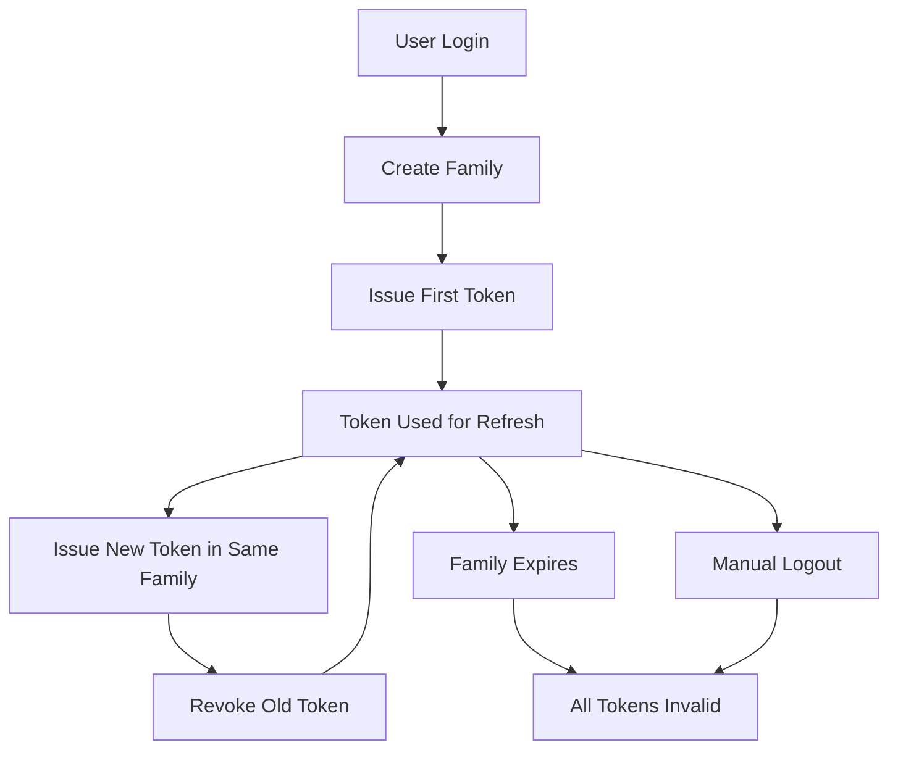

# Tokens Schema Guide

This guide covers the tokens schema (`src/db/tokens.schema.ts`), which implements JWT refresh token management with family-based token rotation for enhanced security.

## Overview

The tokens schema provides a secure JWT refresh token management system that implements:

- **Token Families**: Grouped tokens for automatic revocation on compromise
- **Token Rotation**: New tokens issued on each refresh for enhanced security
- **Automatic Expiration**: Both idle and absolute expiration times
- **Revocation Tracking**: Track when tokens are revoked and why

## Table Structure

### `refreshFamiliesTable`

Groups related refresh tokens together for security and management purposes.

```typescript
export const refreshFamiliesTable = pgTable("refresh_families", {
    familyId: uuid("family_id").primaryKey().defaultRandom(),
    userId: integer("user_id")
        .notNull()
        .references(() => usersTable.id),
    createdAt: timestamp("created_at").notNull().defaultNow(),
    absoluteExpiry: timestamp("absolute_expiry").notNull(),
});
```

| Column           | Type        | Constraints                 | Description                    |
| ---------------- | ----------- | --------------------------- | ------------------------------ |
| `familyId`       | `uuid`      | Primary Key, Auto-generated | Unique family identifier       |
| `userId`         | `integer`   | Not Null, Foreign Key       | References `usersTable.id`     |
| `createdAt`      | `timestamp` | Not Null, Default: now()    | Family creation timestamp      |
| `absoluteExpiry` | `timestamp` | Not Null                    | When the entire family expires |

### `refreshTokensTable`

Stores individual refresh tokens within a family.

```typescript
export const refreshTokensTable = pgTable("refresh_tokens", {
    jti: uuid("jti").primaryKey(),
    familyId: uuid("family_id")
        .notNull()
        .references(() => refreshFamiliesTable.familyId),
    issuedAt: timestamp("issued_at").notNull().defaultNow(),
    revokedAt: timestamp("revoked_at"),
});
```

| Column      | Type        | Constraints              | Description                                |
| ----------- | ----------- | ------------------------ | ------------------------------------------ |
| `jti`       | `uuid`      | Primary Key              | JWT ID (unique token identifier)           |
| `familyId`  | `uuid`      | Not Null, Foreign Key    | References `refreshFamiliesTable.familyId` |
| `issuedAt`  | `timestamp` | Not Null, Default: now() | Token issue timestamp                      |
| `revokedAt` | `timestamp` | Nullable                 | Token revocation timestamp                 |

## Token Family Concept

### What is a Token Family?

A token family is a group of related refresh tokens that belong to the same login session. When a user logs in, a new family is created, and all subsequent token rotations belong to that family.

### Security Benefits

1. **Automatic Revocation**: If any token in a family is compromised, the entire family can be revoked
2. **Compromise Detection**: Using an old/revoked token indicates potential compromise
3. **Session Management**: Easy to revoke all tokens for a specific login session

### Family Lifecycle



## Token Rotation Process

### Standard Token Refresh

1. **Client sends refresh token**
2. **Server validates token**
3. **Server checks token family**
4. **Server issues new tokens**
5. **Server revokes old refresh token**
6. **Client receives new tokens**

### Compromise Detection

If a revoked token is used:

1. **Entire family is revoked**
2. **All tokens in family become invalid**
3. **User must re-authenticate**

## Usage Examples

### 1. Repository Layer

```typescript
import { refreshFamiliesTable, refreshTokensTable } from "@/db/tokens.schema";
import { REFRESH_ABSOLUTE_TTL, REFRESH_IDLE_TTL } from "@/config/env";
import { eq, and, isNull } from "drizzle-orm";

@injectable()
export class TokenRepository {
    async createTokenFamily(userId: number): Promise<string> {
        const absoluteExpiry = new Date(Date.now() + REFRESH_ABSOLUTE_TTL * 1000);

        const [family] = await this.db
            .insert(refreshFamiliesTable)
            .values({
                userId,
                absoluteExpiry,
            })
            .returning();

        return family.familyId;
    }

    async createRefreshToken(jti: string, familyId: string): Promise<void> {
        await this.db.insert(refreshTokensTable).values({
            jti,
            familyId,
        });
    }

    async revokeToken(jti: string): Promise<void> {
        await this.db.update(refreshTokensTable).set({ revokedAt: new Date() }).where(eq(refreshTokensTable.jti, jti));
    }

    async isTokenValid(jti: string): Promise<boolean> {
        const [token] = await this.db
            .select()
            .from(refreshTokensTable)
            .innerJoin(refreshFamiliesTable, eq(refreshTokensTable.familyId, refreshFamiliesTable.familyId))
            .where(and(eq(refreshTokensTable.jti, jti), isNull(refreshTokensTable.revokedAt)));

        if (!token) return false;

        // Check if family is expired
        return new Date() < token.refresh_families.absoluteExpiry;
    }

    async revokeTokenFamily(familyId: string): Promise<void> {
        await this.db
            .update(refreshTokensTable)
            .set({ revokedAt: new Date() })
            .where(eq(refreshTokensTable.familyId, familyId));
    }
}
```

### 2. Authentication Service Integration

```typescript
import { TokenRepository } from "@/repositories/token.repository";
import { JWT_REFRESH_SECRET, JWT_SECRET, ACCESS_LIFETIME, REFRESH_IDLE_TTL } from "@/config/env";

@injectable()
export class AuthenticationService {
    constructor(@inject(TYPES.TokenRepository) private tokenRepository: TokenRepository) {}

    async generateTokens(userId: number): Promise<{ accessToken: string; refreshToken: string }> {
        // Create token family
        const familyId = await this.tokenRepository.createTokenFamily(userId);

        // Generate JTI for this token
        const jti = randomUUID();

        // Create refresh token record
        await this.tokenRepository.createRefreshToken(jti, familyId);

        // Generate JWT tokens
        const accessToken = jwt.sign({ sub: userId.toString(), jti }, JWT_SECRET, { expiresIn: ACCESS_LIFETIME });

        const refreshToken = jwt.sign({ sub: userId.toString(), jti, family_id: familyId }, JWT_REFRESH_SECRET, {
            expiresIn: REFRESH_IDLE_TTL,
        });

        return { accessToken, refreshToken };
    }

    async refreshTokens(refreshToken: string): Promise<{ accessToken: string; refreshToken: string }> {
        // Verify refresh token
        const payload = jwt.verify(refreshToken, JWT_REFRESH_SECRET) as JwtRefreshPayload;
        const { sub, jti, family_id } = payload;

        // Check if token is valid and not revoked
        const isValid = await this.tokenRepository.isTokenValid(jti);

        if (!isValid) {
            // Token was revoked or family expired - possible compromise
            await this.tokenRepository.revokeTokenFamily(family_id);
            throw new Error("Token invalid or compromised");
        }

        // Revoke the used token
        await this.tokenRepository.revokeToken(jti);

        // Generate new tokens in the same family
        const newJti = randomUUID();
        await this.tokenRepository.createRefreshToken(newJti, family_id);

        const newAccessToken = jwt.sign({ sub, jti: newJti }, JWT_SECRET, { expiresIn: ACCESS_LIFETIME });

        const newRefreshToken = jwt.sign({ sub, jti: newJti, family_id }, JWT_REFRESH_SECRET, {
            expiresIn: REFRESH_IDLE_TTL,
        });

        return {
            accessToken: newAccessToken,
            refreshToken: newRefreshToken,
        };
    }

    async logout(refreshToken: string): Promise<void> {
        try {
            const payload = jwt.verify(refreshToken, JWT_REFRESH_SECRET) as JwtRefreshPayload;
            await this.tokenRepository.revokeTokenFamily(payload.family_id);
        } catch (error) {
            // Token might be invalid, but we should still try to clean up
            console.warn("Error during logout:", error);
        }
    }
}
```

### 3. Authentication Middleware

```typescript
import { JWT_SECRET } from "@/config/env";

export const authenticateToken = async (req: Request, res: Response, next: NextFunction) => {
    const authHeader = req.headers.authorization;
    const token = authHeader?.split(" ")[1]; // Bearer TOKEN

    if (!token) {
        return res.status(401).json({ message: "Access token required" });
    }

    try {
        const payload = jwt.verify(token, JWT_SECRET) as JwtPayload;
        req.user = { id: parseInt(payload.sub) };
        next();
    } catch (error) {
        return res.status(403).json({ message: "Invalid access token" });
    }
};
```

## Environment Configuration

The token system uses several environment variables from `@/config/env`:

### Token Lifetimes

```typescript
// From src/config/env.ts
export const ACCESS_LIFETIME = "15m"; // 15 minutes
export const REFRESH_IDLE_TTL = 7 * 24 * 3600; // 7 days (seconds)
export const REFRESH_ABSOLUTE_TTL = 30 * 24 * 3600; // 30 days (seconds)
```

### Usage in Repository

```typescript
import { REFRESH_IDLE_TTL, REFRESH_ABSOLUTE_TTL } from "@/config/env";

// Calculate absolute expiry for family
const absoluteExpiry = new Date(Date.now() + REFRESH_ABSOLUTE_TTL * 1000);

// JWT expiration uses REFRESH_IDLE_TTL
const refreshToken = jwt.sign(payload, JWT_REFRESH_SECRET, {
    expiresIn: REFRESH_IDLE_TTL,
});
```

## Security Considerations

### 1. Token Rotation

- **Always rotate refresh tokens** on each use
- **Revoke old tokens** immediately after issuing new ones
- **Never reuse** refresh tokens

### 2. Family-Based Revocation

- **Revoke entire family** if compromise is detected
- **Track revocation timestamps** for audit purposes
- **Monitor for** suspicious token usage patterns

### 3. Expiration Management

- **Implement both idle and absolute expiration**
- **Clean up expired families** regularly
- **Respect JWT expiration times**

### 4. Storage Security

- **Store tokens securely** on the client side
- **Use HTTPS** for all token transmission
- **Consider token encryption** for additional security

## Common Queries

### Check Token Validity

```typescript
const isValid = await db
    .select()
    .from(refreshTokensTable)
    .innerJoin(refreshFamiliesTable, eq(refreshTokensTable.familyId, refreshFamiliesTable.familyId))
    .where(
        and(
            eq(refreshTokensTable.jti, jti),
            isNull(refreshTokensTable.revokedAt),
            sql`${refreshFamiliesTable.absoluteExpiry} > NOW()`,
        ),
    );
```

### Get User's Active Families

```typescript
const activeFamilies = await db
    .select()
    .from(refreshFamiliesTable)
    .where(and(eq(refreshFamiliesTable.userId, userId), sql`${refreshFamiliesTable.absoluteExpiry} > NOW()`));
```

### Clean Up Expired Tokens

```typescript
// Clean up expired families
await db.delete(refreshFamiliesTable).where(sql`${refreshFamiliesTable.absoluteExpiry} <= NOW()`);

// Clean up orphaned tokens (families were deleted)
await db.delete(refreshTokensTable).where(
    sql`${refreshTokensTable.familyId} NOT IN (
            SELECT ${refreshFamiliesTable.familyId} FROM ${refreshFamiliesTable}
        )`,
);
```

### Get Family Statistics

```typescript
const familyStats = await db
    .select({
        familyId: refreshFamiliesTable.familyId,
        userId: refreshFamiliesTable.userId,
        createdAt: refreshFamiliesTable.createdAt,
        tokenCount: sql<number>`COUNT(${refreshTokensTable.jti})`,
        activeTokens: sql<number>`COUNT(CASE WHEN ${refreshTokensTable.revokedAt} IS NULL THEN 1 END)`,
    })
    .from(refreshFamiliesTable)
    .leftJoin(refreshTokensTable, eq(refreshFamiliesTable.familyId, refreshTokensTable.familyId))
    .groupBy(refreshFamiliesTable.familyId);
```

## Type Definitions

### Inferred Types

```typescript
// Table types
type RefreshFamily = typeof refreshFamiliesTable.$inferSelect;
type RefreshToken = typeof refreshTokensTable.$inferSelect;

// Insert types
type NewRefreshFamily = typeof refreshFamiliesTable.$inferInsert;
type NewRefreshToken = typeof refreshTokensTable.$inferInsert;
```

### JWT Payload Types

```typescript
// Access token payload
export interface JwtPayload {
    sub: string; // User ID
    jti: string; // Token ID
    iat: number; // Issued at
    exp: number; // Expires at
}

// Refresh token payload
export interface JwtRefreshPayload extends JwtPayload {
    family_id: string; // Token family ID
}
```

### Custom Types

```typescript
// Token pair
export type TokenPair = {
    accessToken: string;
    refreshToken: string;
};

// Family with token count
export type FamilyWithStats = {
    family: RefreshFamily;
    totalTokens: number;
    activeTokens: number;
    revokedTokens: number;
};

// Token validation result
export type TokenValidation = {
    isValid: boolean;
    isExpired: boolean;
    isRevoked: boolean;
    familyId?: string;
    userId?: number;
};
```

## Testing Patterns

### Repository Tests

```typescript
describe("TokenRepository", () => {
    it("should create token family", async () => {
        const userId = 1;

        const familyId = await tokenRepository.createTokenFamily(userId);

        expect(familyId).toBeDefined();
        expect(typeof familyId).toBe("string");
    });

    it("should revoke token family", async () => {
        const familyId = await createTestTokenFamily();
        const jti = await createTestRefreshToken(familyId);

        await tokenRepository.revokeTokenFamily(familyId);

        const isValid = await tokenRepository.isTokenValid(jti);
        expect(isValid).toBe(false);
    });
});
```

### Service Tests

```typescript
describe("AuthenticationService", () => {
    it("should generate token pair", async () => {
        const userId = 1;

        const tokens = await authService.generateTokens(userId);

        expect(tokens.accessToken).toBeDefined();
        expect(tokens.refreshToken).toBeDefined();

        // Verify token structure
        const accessPayload = jwt.decode(tokens.accessToken) as JwtPayload;
        expect(accessPayload.sub).toBe(userId.toString());
    });

    it("should refresh tokens", async () => {
        const userId = 1;
        const { refreshToken } = await authService.generateTokens(userId);

        const newTokens = await authService.refreshTokens(refreshToken);

        expect(newTokens.accessToken).toBeDefined();
        expect(newTokens.refreshToken).toBeDefined();
        expect(newTokens.refreshToken).not.toBe(refreshToken);
    });
});
```

## Performance Considerations

### 1. Index Strategy

```sql
-- Indexes for optimal query performance
CREATE INDEX idx_refresh_tokens_family_id ON refresh_tokens(family_id);
CREATE INDEX idx_refresh_tokens_jti ON refresh_tokens(jti);
CREATE INDEX idx_refresh_families_user_id ON refresh_families(user_id);
CREATE INDEX idx_refresh_families_absolute_expiry ON refresh_families(absolute_expiry);
```

### 2. Cleanup Strategy

- **Schedule regular cleanup** of expired families
- **Use batch operations** for bulk token operations
- **Monitor table growth** and implement archiving if needed

### 3. Caching Strategy

- **Cache frequently accessed families** in Redis
- **Cache user's active families** for faster lookups
- **Invalidate cache** on token revocation

## Migration History

### Related Migrations

- `0001_tokens.sql` - Initial token tables creation
- See migration files for token system evolution

## Related Documentation

- [Authentication Service Guide](../services/authentication-service.guide.md)
- [Token Repository Guide](../repositories/token-repository.guide.md)
- [JWT Configuration Guide](../config/env.guide.md#jwt-configuration)
- [Authentication Middleware Guide](../middlewares/authentication-guard.guide.md)
